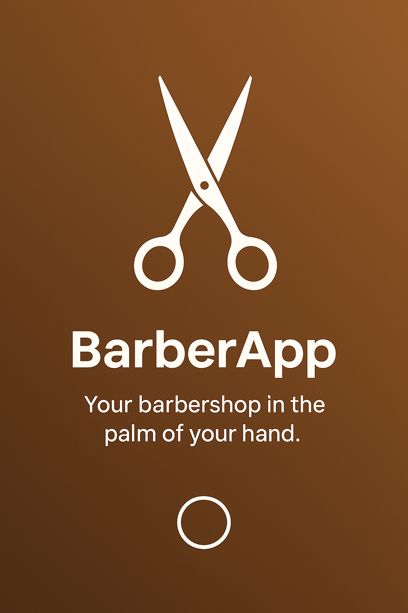
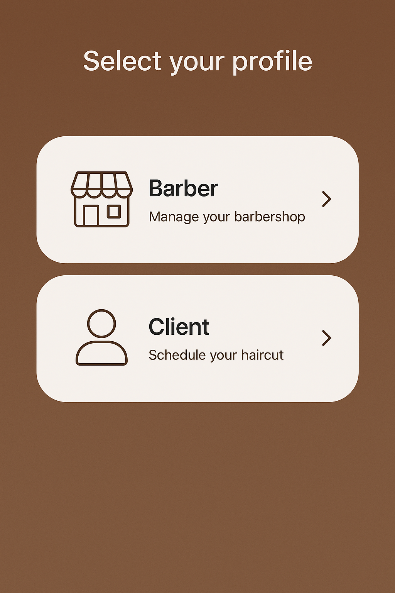
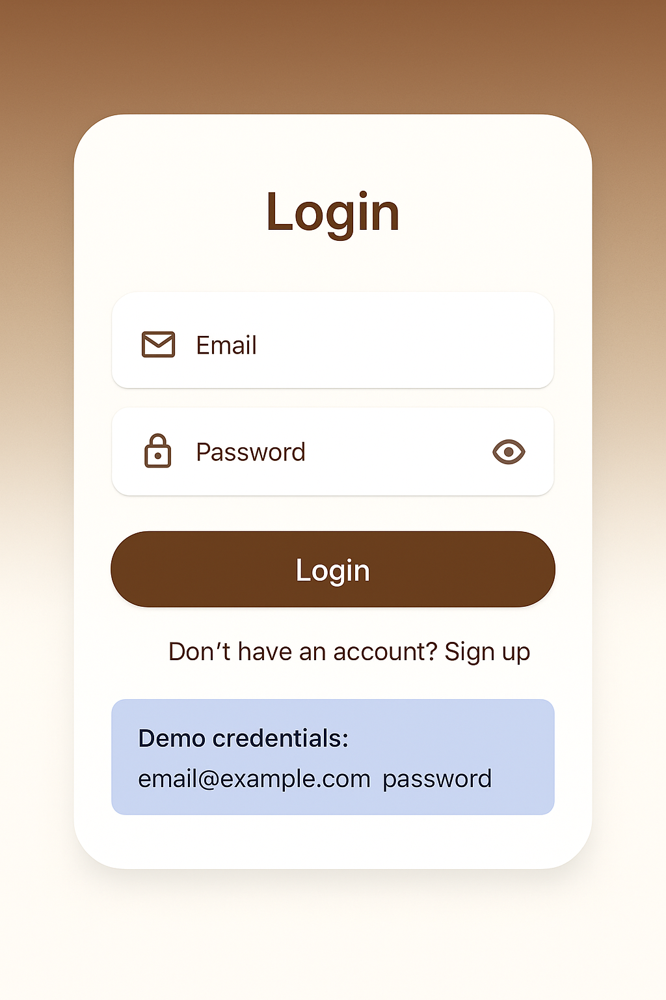
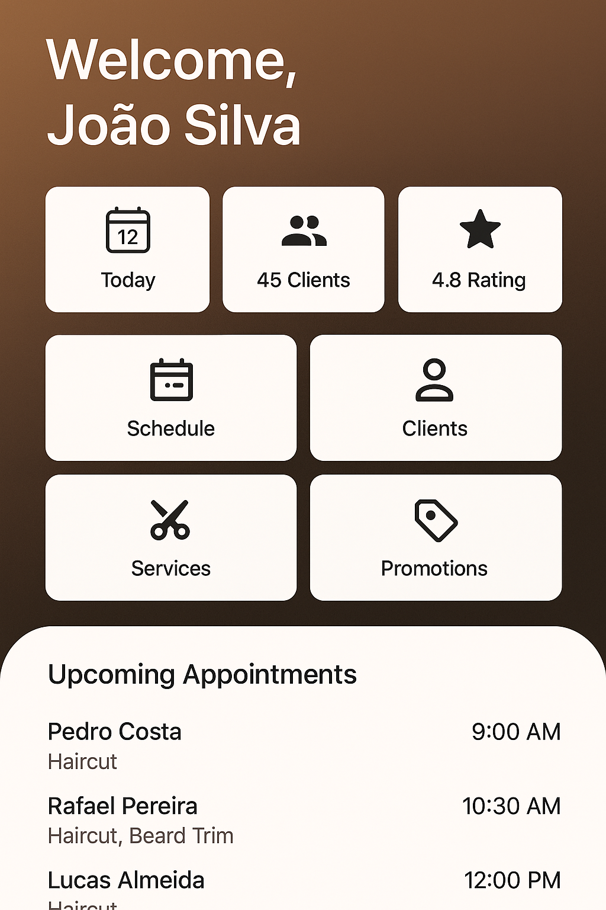
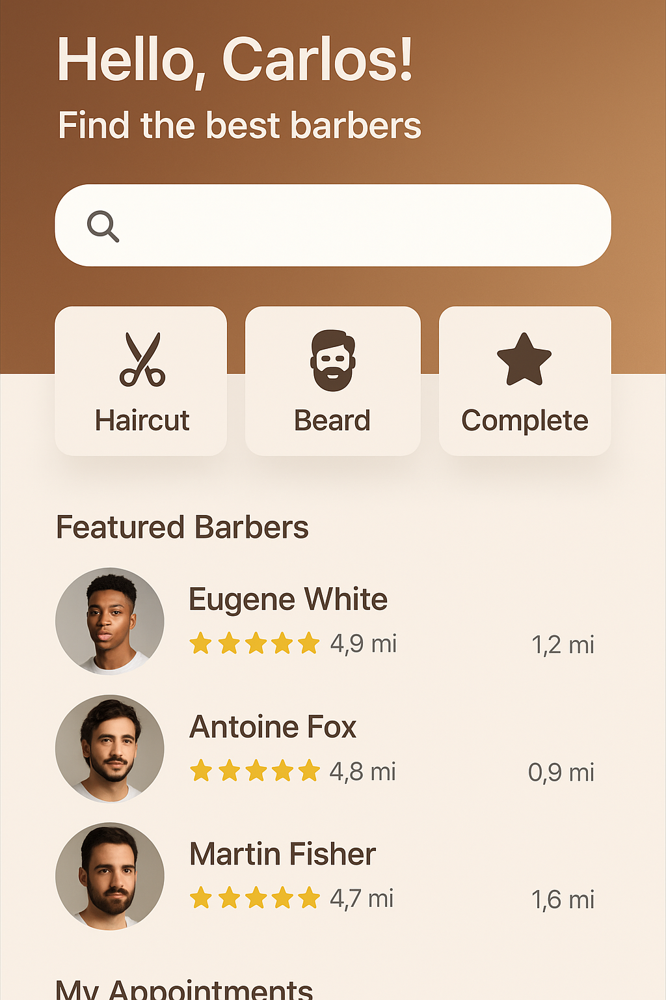

# 💈 BarberApp - Aplicativo de Gestão de Barbearia

<div align="center">

**Sua barbearia na palma da mão**

[](https://flutter.dev)
[](https://dart.dev)
[](LICENSE)

</div>

---

## 📱 Sobre o Projeto

O **BarberApp** é um aplicativo completo de gestão de barbearia desenvolvido em Flutter, com arquitetura profissional Clean Architecture + MVVM. O app permite que barbeiros gerenciem seus clientes, agendamentos e serviços, enquanto clientes podem buscar barbeiros e agendar horários de forma prática.

### 🎯 Modelo de Negócio SaaS

- **Barbeiros** pagam mensalidade para usar a plataforma
- **Clientes** usam gratuitamente para agendar serviços
- **Administrador** tem controle total da plataforma

---

## ✨ Funcionalidades

### Para Barbeiros
- ✅ Dashboard com estatísticas em tempo real
- ✅ Gestão completa de clientes
- ✅ Sistema de agendamentos
- ✅ Cadastro de serviços e preços
- ✅ Criação de promoções
- ✅ Integração com WhatsApp
- ✅ Notificações push

### Para Clientes
- ✅ Busca de barbeiros por localização
- ✅ Agendamento online
- ✅ Histórico de cortes
- ✅ Recebimento de promoções
- ✅ Avaliação de barbeiros

### Para Administradores
- ✅ Dashboard com métricas globais
- ✅ Gerenciamento de barbeiros
- ✅ Controle de pagamentos
- ✅ Relatórios financeiros

---

## 📸 Screenshots

<div align="center">

<table>
  <tr>
    <td></td>
    <td></td>
    <td></td>
  </tr>
  <tr>
    <td align="center"><b>Splash Screen</b></td>
    <td align="center"><b>Seleção de Perfil</b></td>
    <td align="center"><b>Login</b></td>
  </tr>
  <tr>
    <td></td>
    <td></td>
    <td></td>
  </tr>
  <tr>
    <td align="center"><b>Dashboard Barbeiro</b></td>
    <td align="center"><b>Área Cliente</b></td>
    <td></td>
  </tr>
</table>

</div>

---

## 🏗️ Arquitetura

O projeto segue os princípios de **Clean Architecture** combinado com **MVVM** para garantir:

- ✅ Separação clara de responsabilidades
- ✅ Código testável e manutenível
- ✅ Independência de frameworks
- ✅ Facilidade para escalar

### Estrutura de Camadas

```
┌─────────────────────────────────────────────┐
│           Presentation Layer                │
│  (Screens, Widgets, Providers)              │
└─────────────────┬───────────────────────────┘
                  │
┌─────────────────▼───────────────────────────┐
│            Domain Layer                     │
│  (Entities, Use Cases, Repositories)        │
└─────────────────┬───────────────────────────┘
                  │
┌─────────────────▼───────────────────────────┐
│             Data Layer                      │
│  (Models, Repositories Impl, DataSources)   │
└─────────────────────────────────────────────┘
```

---

## 🚀 Como Executar

### Pré-requisitos

- Flutter SDK 3.24.5 ou superior
- Android Studio (para Android) ou Xcode (para iOS)
- Git

### Instalação

```bash
# Clone o repositório
git clone https://github.com/WallisonWS/app-de-barbearia-flutter.git
cd app-de-barbearia-flutter

# Instale as dependências
flutter pub get

# Execute o app
flutter run
```

### Credenciais de Demonstração

#### Barbeiro
```
E-mail: joao@barbearia.com
Senha: barber123
```

#### Cliente
```
E-mail: carlos@email.com
Senha: client123
```

**Guia completo**: Consulte [COMO_EXECUTAR.md](COMO_EXECUTAR.md)

---

## 🛠️ Tecnologias Utilizadas

- **[Flutter 3.24.5](https://flutter.dev)** - Framework multiplataforma
- **[Dart 3.5.4](https://dart.dev)** - Linguagem de programação
- **[Provider](https://pub.dev/packages/provider)** - Gerenciamento de estado
- **[GoRouter](https://pub.dev/packages/go_router)** - Navegação declarativa
- **[Google Fonts](https://pub.dev/packages/google_fonts)** - Tipografia Poppins
- **[SharedPreferences](https://pub.dev/packages/shared_preferences)** - Armazenamento local
- **[Firebase](https://firebase.google.com)** - Backend (Authentication, Firestore, Storage, FCM)
- **[Mercado Pago](https://www.mercadopago.com.br)** - Gateway de pagamento

---

## 📂 Estrutura do Projeto

```
lib/
├── core/
│   ├── constants/          # Cores, strings, rotas
│   ├── errors/             # Tratamento de erros
│   ├── services/           # Serviços (auth, storage)
│   ├── utils/              # Utilitários
│   └── widgets/            # Widgets reutilizáveis
├── data/
│   ├── datasources/        # Fontes de dados (Firebase, API)
│   ├── models/             # Modelos de dados
│   └── repositories/       # Implementação de repositórios
├── domain/
│   ├── entities/           # Entidades de negócio
│   ├── repositories/       # Contratos de repositórios
│   └── usecases/           # Casos de uso
├── presentation/
│   ├── providers/          # Providers (estado)
│   ├── screens/            # Telas do app
│   │   ├── auth/          # Autenticação
│   │   ├── barber/        # Área do barbeiro
│   │   ├── client/        # Área do cliente
│   │   └── admin/         # Área administrativa
│   └── widgets/            # Widgets específicos
└── main.dart               # Ponto de entrada
```

---

## 🎨 Design System

### Paleta de Cores

- **Primary**: `#8B4513` (Marrom) - Cor clássica de barbearia
- **Secondary**: `#D4AF37` (Dourado) - Elegância e sofisticação
- **Background**: `#F5F5F5` (Cinza claro)
- **Surface**: `#FFFFFF` (Branco)

### Tipografia

- **Fonte**: Poppins (Google Fonts)
- **Pesos**: Regular (400), Medium (500), SemiBold (600), Bold (700)

### Componentes

- Cards com elevação e bordas arredondadas (16px)
- Botões com padding generoso e feedback visual
- Inputs com ícones e validação em tempo real
- Animações suaves de transição

---

## 💰 Modelo de Receita

### Assinatura Mensal
- **Preço sugerido**: R$ 99,90/mês por barbeiro
- **Período de teste**: 7 dias grátis

### Projeções de Receita

| Barbeiros | Receita Mensal | Receita Anual |
|-----------|----------------|---------------|
| 20        | R$ 1.998       | R$ 23.976     |
| 50        | R$ 4.995       | R$ 59.940     |
| 100       | R$ 9.990       | R$ 119.880    |

### Custos Operacionais (100 barbeiros)
- Firebase: R$ 100-250/mês
- Domínio: R$ 40/ano
- **Lucro líquido**: R$ 9.700/mês

---

## 📚 Documentação

- **[ARQUITETURA.md](ARQUITETURA.md)** - Arquitetura detalhada do sistema
- **[ESPECIFICACOES_TECNICAS.md](ESPECIFICACOES_TECNICAS.md)** - Detalhes técnicos de implementação
- **[CONFIGURACAO_FIREBASE.md](CONFIGURACAO_FIREBASE.md)** - Guia completo de setup do Firebase
- **[PROXIMOS_PASSOS.md](PROXIMOS_PASSOS.md)** - Roadmap detalhado de desenvolvimento
- **[COMO_EXECUTAR.md](COMO_EXECUTAR.md)** - Guia de execução do app

---

## 🗓️ Roadmap

### ✅ Fase 1: MVP (Concluído)
- [x] Estrutura do projeto
- [x] Sistema de autenticação
- [x] Dashboard do barbeiro
- [x] Área do cliente
- [x] Design system completo

### 🚧 Fase 2: Funcionalidades Core (Em desenvolvimento)
- [ ] Integração Firebase real
- [ ] Sistema de agendamentos com calendário
- [ ] Gestão completa de clientes
- [ ] CRUD de serviços

### 📅 Fase 3: Funcionalidades Avançadas (Planejado)
- [ ] Sistema de promoções
- [ ] Integração WhatsApp
- [ ] Notificações push
- [ ] Painel administrativo

### 🎯 Fase 4: Monetização (Planejado)
- [ ] Integração Mercado Pago
- [ ] Sistema de assinaturas
- [ ] Controle de pagamentos
- [ ] Relatórios financeiros

### 🚀 Fase 5: Publicação (Planejado)
- [ ] Testes em dispositivos reais
- [ ] Build para Android e iOS
- [ ] Submissão para Google Play
- [ ] Submissão para App Store

---

## 🤝 Como Contribuir

1. Faça um fork do projeto
2. Crie uma branch para sua feature (`git checkout -b feature/MinhaFeature`)
3. Commit suas mudanças (`git commit -m 'Adiciona MinhaFeature'`)
4. Push para a branch (`git push origin feature/MinhaFeature`)
5. Abra um Pull Request

---

## 📄 Licença

Este projeto está sob a licença MIT. Veja o arquivo [LICENSE](LICENSE) para mais detalhes.

---

## 👨‍💻 Autor

**Wallison Santos**

- GitHub: [@WallisonWS](https://github.com/WallisonWS)
- Repositório: [app-de-barbearia-flutter](https://github.com/WallisonWS/app-de-barbearia-flutter)

---

## 🙏 Agradecimentos

- [Flutter](https://flutter.dev) - Framework incrível
- [Firebase](https://firebase.google.com) - Backend como serviço
- [Material Design](https://m3.material.io) - Design system
- [Google Fonts](https://fonts.google.com) - Tipografia

---

<div align="center">

**Desenvolvido com ❤️ e Flutter**

⭐ Se este projeto te ajudou, considere dar uma estrela!

</div>
